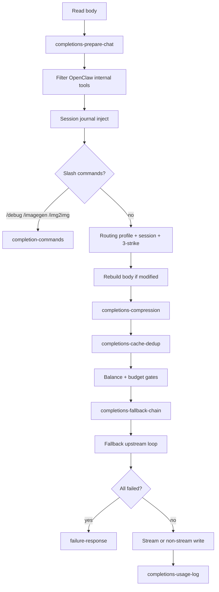

# Proxy chat completions pipeline

This document describes the main stages of `proxyRequest` for `/v1/chat/completions` in OmbRouter (`src/proxy/chat/completions.ts` and extracted modules).

## Flow (Mermaid)

## Stage responsibilities

| Stage | Module / location | Responsibility |
|--------|-------------------|----------------|
| Prepare chat body | `completions-prepare-chat.ts` | Parse JSON, tool filter, journal, slash commands, routing / session / rebuild body. |
| Tool filter | `openclaw-internal-tools.ts` | Strip OpenClaw-only tools from `parsed.tools`. |
| Journal | `SessionJournal` | Inject formatted session history when the user message implies past context. |
| Slash commands | `completion-commands.ts` | `/debug` diagnostics, `/imagegen`, `/img2img` — synthetic completions, no chat upstream. |
| Routing | `completion-routing.ts` | Force `stream: false` for upstream, resolve aliases, routing profiles, session pin/upgrade, three-strike escalation. |
| Auto-compress | `completions-compression.ts` | Optional LLM-safe compression when body exceeds threshold (uses `compression/`). |
| Cache / dedup | `completions-cache-dedup.ts` | Long-TTL cache short-circuit, dedup cache / in-flight wait, `markInflight` (uses `response-cache.ts`, `dedup.ts`). |
| Budget | `budget.ts` | Strict cost cap, graceful precheck, model filter / downgrade notices. |
| Fallback chain build | `completions-fallback-chain.ts` | Tier chain, context/tool/vision filters, free tail, graceful budget model filter. |
| Fallback | `fallback-loop.ts` | Try models in order with timeouts and error classification. |
| All failed | `failure-response.ts` | SSE or JSON error, payment message shaping, dedup complete, usage log. |
| Success usage | `completions-usage-log.ts` | Fire-and-forget `logUsage` from x402 amount or local estimate. |

## Request trace (`request-trace.ts`)

- **Request id**: taken from `x-request-id`, then `x-correlation-id`, then `x-ombrouter-request-id` (sanitized); if missing or invalid, a new UUID is generated.
- **Logs**: lines from the main proxy path and `fallback-loop` are prefixed with `[OmbRouter][req=<id>]`.
- **Response headers**: the id is echoed on streaming `200` responses, cache/dedup replays, and JSON error responses (header name defaults to `x-request-id`).
- **JSON errors**: when enabled, `request_id` is added on the nested `error` object (or top-level when there is no `error` wrapper).
- **Upstream**: `x-request-id` is set on forwarded BlockRun requests.
- **Options** (`ProxyOptions.requestTrace`): `enabled` (default true; when false, internal id still used for logs but the response header is omitted), `responseHeader` (default `x-request-id`), `includeInErrorBody` (default true).

## Related tests

- `budget.test.ts` — budget pure functions.
- `failure-response.test.ts` — failure SSE payload shape.
- `openclaw-internal-tools.test.ts` — internal tool filtering.
- `request-trace.test.ts` — request id resolution and sanitization.
- `completions-compression.test.ts` — below-threshold / disabled compression short-circuit.
- `completions-cache-dedup.test.ts` — cache hit vs continue + `markInflight`.
